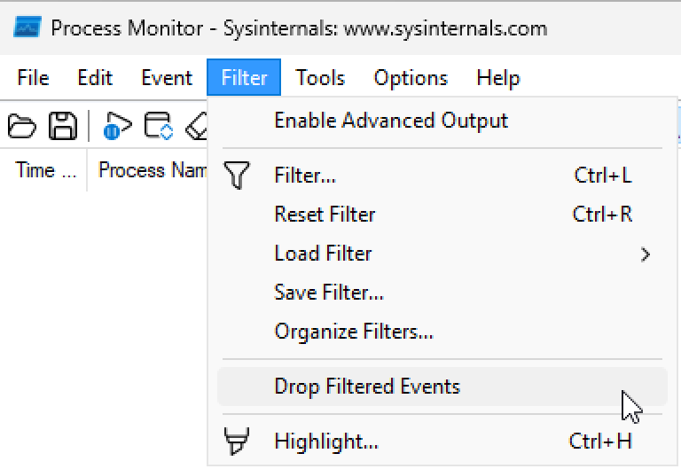
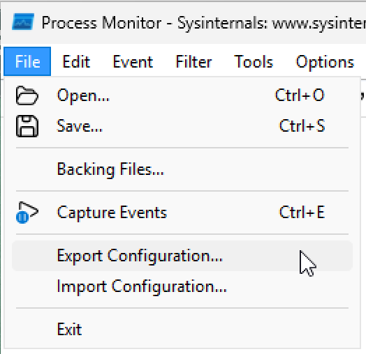

# Big Brother is Watching Screenshots

For some reason, ZoomIt Live was causing issues with screen, so for two actions that I wanted to share in that mode:

1. Option to drop events that are filtered out (to prevent killing remote system)

2. Option to export configuration to be used on a remote system

